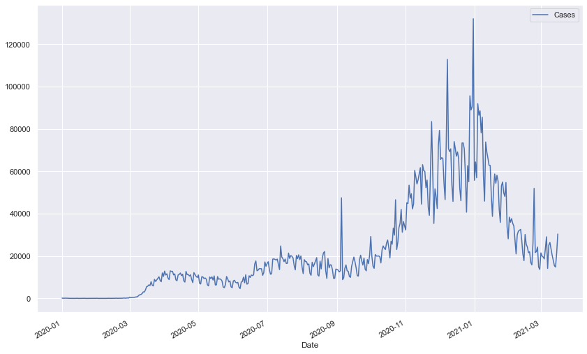
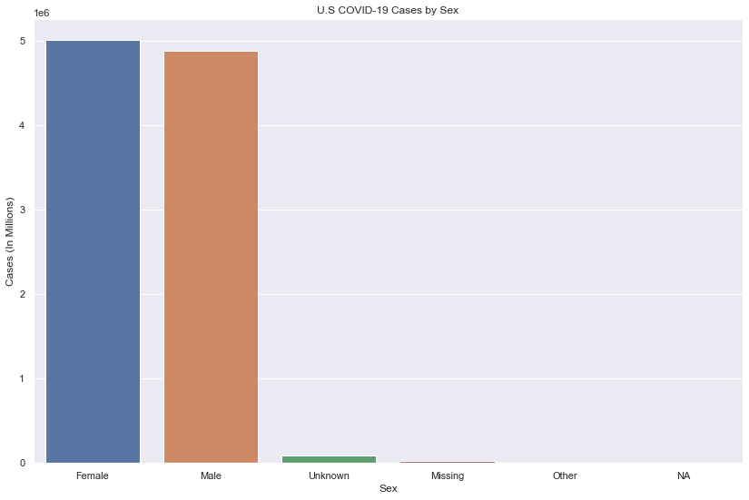
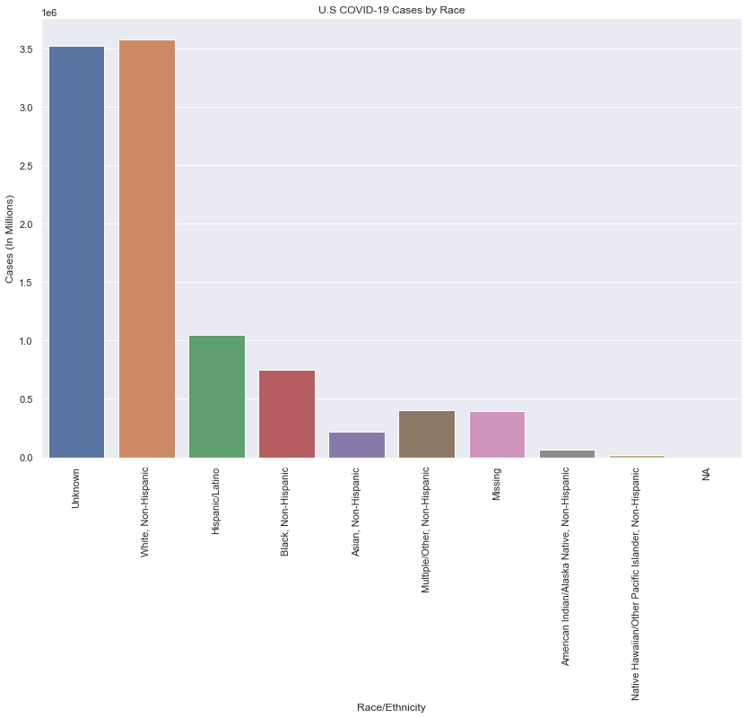
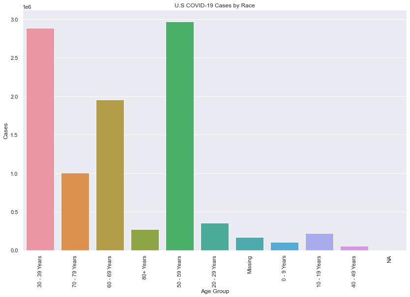

# CDC COVID-19 U.S. Case Surveillance
### Gather 10M records from the CDC public data set to create a time series starting from January 2020, frequency plots by category

### Links:
[CDC COVID-19 Case Surveillance Public Use Data](https://data.cdc.gov/Case-Surveillance/COVID-19-Case-Surveillance-Public-Use-Data/vbim-akqf)

[CDC API Website](https://dev.socrata.com/foundry/data.cdc.gov/vbim-akqf) 

---

## Time Series

NOTE: Dips in graph are from missing records, I could only retrieve 10M of over 20M as my computer could not handle that many

## Gender Frequency

## Race/Ethnicity Frequency

## Age Group Frequency

